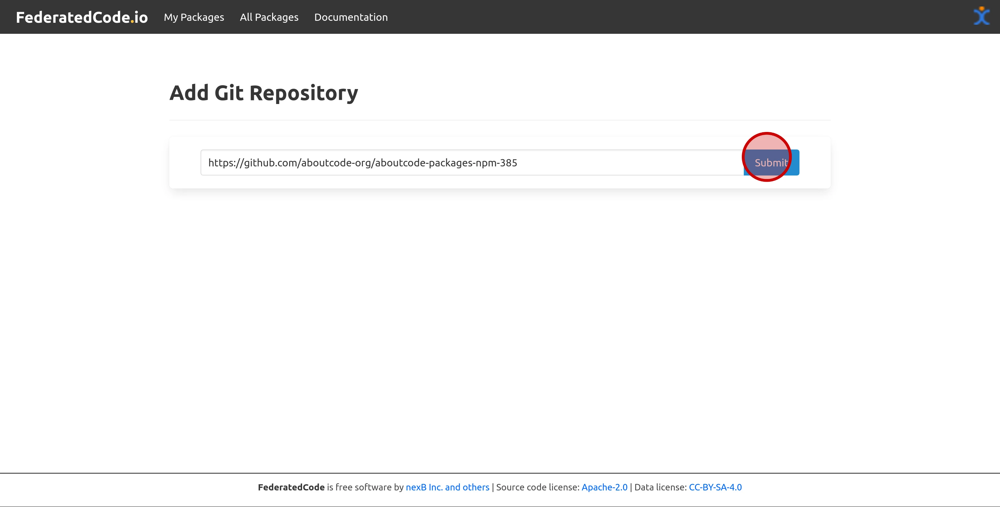
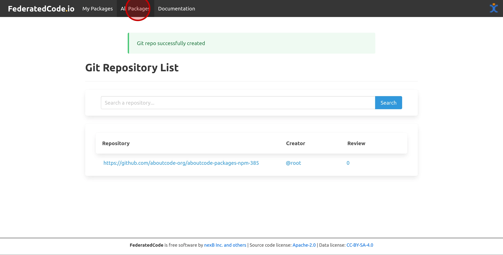
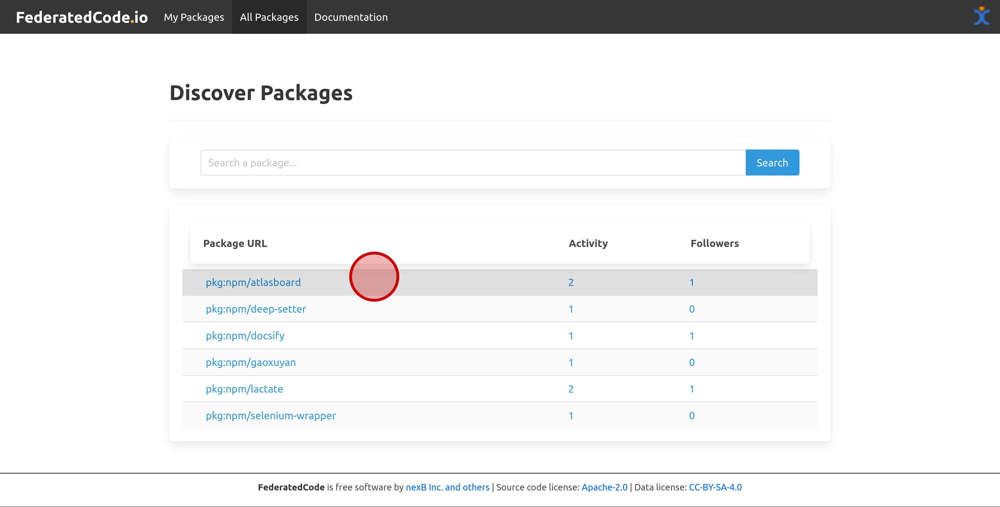
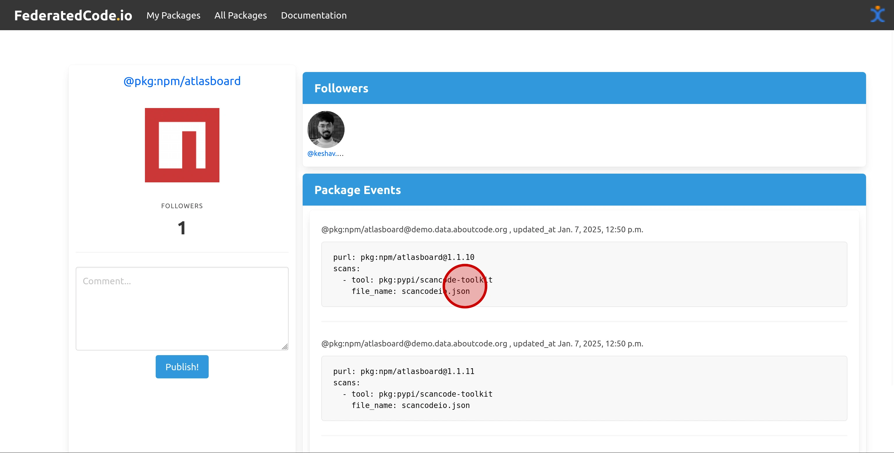

.. _tutorial_getting_started:

Getting Started
===============

In this tutorial, we will guide you through the step-by-step process of getting started with syncing
and federating package metadata.

.. note::
    This tutorial assumes that you have a working installation of FederatedCode.
    If you don't, please refer to the :ref:`installation` page.

Create Admin User
-----------------

.. code-block:: bash

    python manage.py createsuperuser

Log in to FederatedCode Admin
------------------------------

Navigate to http://127.0.0.1:8000/admin/ and log in using the credentials created in the previous step.

Create Service User
-------------------

Go to http://127.0.0.1:8000/admin/fedcode/service/add/ and create a service. Select the newly created superuser as the user, and leave the "remote-actor" field empty.

Clone the FederatedCode Data Repository
---------------------------------------

Visit https://github.com/aboutcode-org/aboutcode-packages-npm-385 and clone the repository.

Add Data Repository in FederatedCode
-------------------------------------

Go to http://127.0.0.1:8000/create-repo and add the repository URL: https://github.com/<YOUR-USER-NAME>/aboutcode-packages-npm-385

Sync Package Scan
-----------------

Run the following command to sync the scan metadata from the FederatedCode Git repository

.. code-block:: bash

    python manage.py sync sync_scancode_scans

Federate Package Activity
-------------------------

Run the following command to send activity updates to existing subscribers of the package

.. code-block:: bash

    python manage.py federate

Click on `Packages` link
--------------------------

Click on any PURL link
----------------------

Package Activity
----------------

