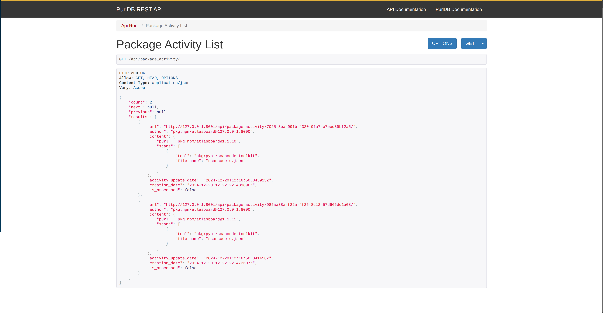

.. _tutorial_remote_subscribe_package_update:

Subscribe to Package Updates (Remote)
=====================================

In this tutorial, we will guide you through the step-by-step process of subscribing to
package updates from a remote user. For this demo, we will subscribe to FederatedCode
package updates in PurlDB. By the end of this tutorial, PurlDB will be able to subscribe
to package updates and will receive ActivityPub streams for the activities of the subscribed
packages.

.. note::
    This tutorial assumes that you have a working installation of FederatedCode.
    If you don't, please refer to the :ref:`installation` page.

Initial Setup (FederatedCode)
-----------------------------

#. Head over to :ref:`tutorial_getting_started` to perform the initial configuration of
   FederatedCode after installation.

#. Navigate to http://127.0.0.1:8000/admin/fedcode/remoteactor/add/ and add the ``purldb`` remote actor.
   Populate the URL with http://127.0.0.1:8001/api/users/@purldb and set the username as ``purldb``.

   .. image:: img/tutorial_remote_subscribe_package_update_add_purldb_remote_actor.jpg

#. Navigate to http://127.0.0.1:8000/admin/fedcode/person/add/ to create the remote actor user.
   For now, enter any value in the summary and public key fields, leave the user field empty,
   and in the ``Remote actor`` dropdown, choose the one created in the previous step.

   .. image:: img/tutorial_remote_subscribe_package_update_create_purldb_remote_actor_user.jpg

Initial Setup (PurlDB)
----------------------

#. Follow the steps here to install PurlDB: https://aboutcode.readthedocs.io/projects/PURLdb/en/latest/getting-started/install.html#installation

#. Add the FederatedCode ActivityPub server host to the ``.env`` file.

    .. code-block:: bash
       :caption: .env

        FEDERATEDCODE_HOST_URL="http://127.0.0.1:8000"

#. Subscribe to a PURL for updates. In this case, since we know that we have the
   ``atlasboard`` package in our FederatedCode, we will subscribe to it.

    .. code-block:: bash

        python manage_purldb.py subscribe_package "pkg:npm/atlasboard"

   On successful subscription, you will see this message:

    .. code-block:: bash

       {"status": "success", "message": "Successfully subscribed to package pkg:npm/atlasboard"}

#. Navigate to http://127.0.0.1:8001/api/package_activity/ (Package updates received from FederatedCode ActivityPub will be available here).

Update Package Scan (Git Repo)
------------------------------

Since we have subscribed to ``pkg:npm/atlasboard``, head over to
https://github.com/<YOUR-GITHUB-USERNAME>/aboutcode-packages-npm-385/blob/main/npm/atlasboard/1.1.10/scancodeio.json,
make some changes, and commit them.

Run Sync and Federate (FederatedCode)
-------------------------------------

#. Run the following command to sync the changes made to the package scan in the Git repository

    .. code-block:: bash

        python manage.py sync sync_scancode_scans

#. Run the following command to send activity updates to existing subscribers of the package

    .. code-block:: bash

        python manage.py federate

Browse the Package Activity (PurlDB)
------------------------------------

Navigate to http://127.0.0.1:8001/api/package_activity/ to view the activity for the subscribed package.

